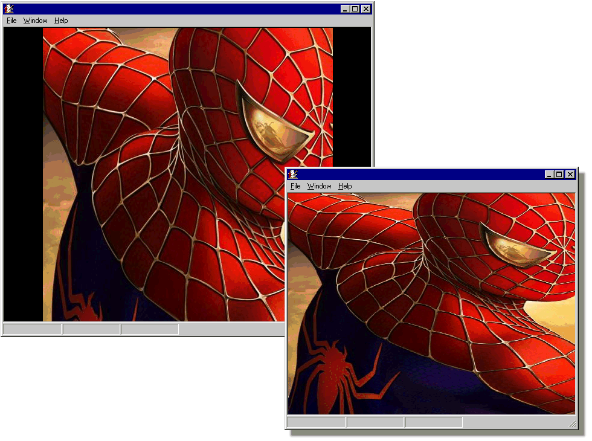



## MDI Background \(centered, stretched\)

### Description

This code demonstrates how to draw an image into your MDI area and serves as image background or logo. With two modes: center and stretch.
 
### More Info
 
Windows Blt API's

             |
---                |---
**Submitted On**   |2004-04-06 09:54:38
**By**             |[Rex Collao Ballester](https://github.com/Planet-Source-Code/PSCIndex/blob/master/ByAuthor/rex-collao-ballester.md)
**Level**          |Advanced
**User Rating**    |4.8 (29 globes from 6 users)
**Compatibility**  |VB 6\.0
**Category**       |[Custom Controls/ Forms/  Menus](https://github.com/Planet-Source-Code/PSCIndex/blob/master/ByCategory/custom-controls-forms-menus__1-4.md)
**World**          |[Visual Basic](https://github.com/Planet-Source-Code/PSCIndex/blob/master/ByWorld/visual-basic.md)
**Archive File**   |[MDI\_Backgr173024472004\.zip](https://github.com/Planet-Source-Code/rex-collao-ballester-mdi-background-centered-stretched__1-52899/archive/master.zip)

